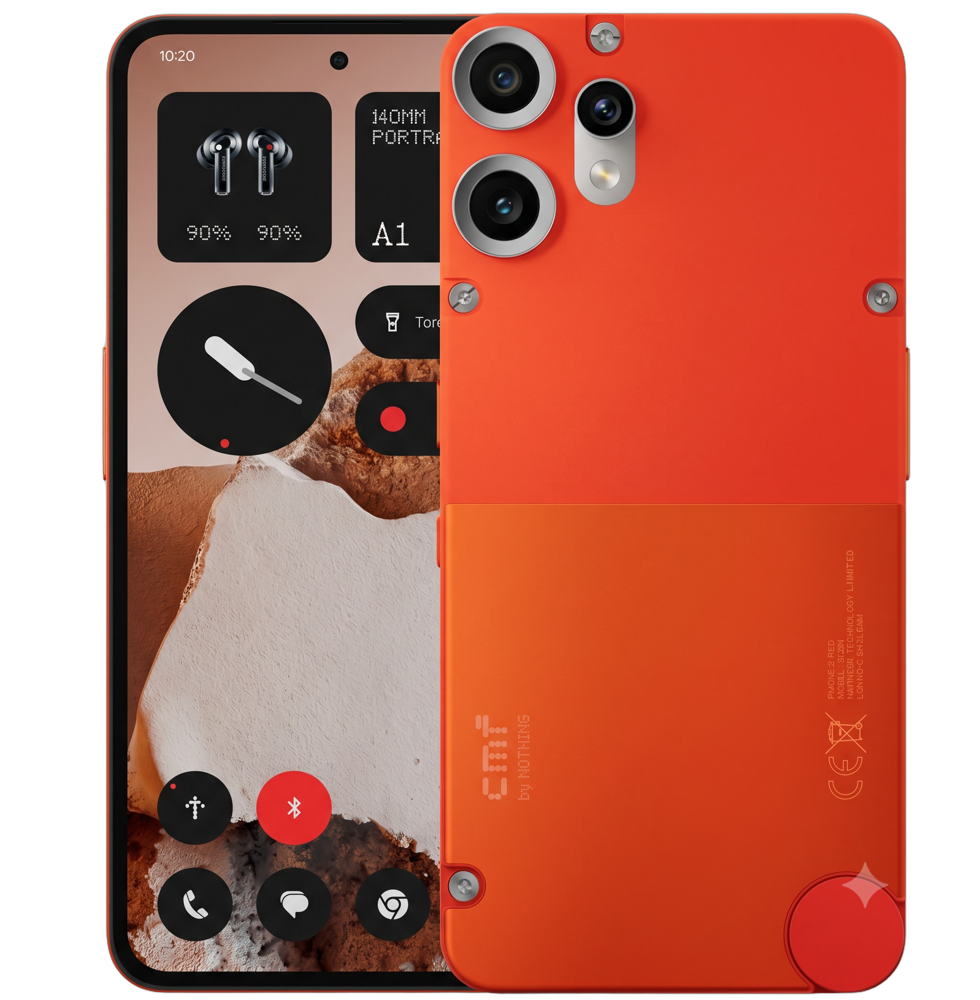
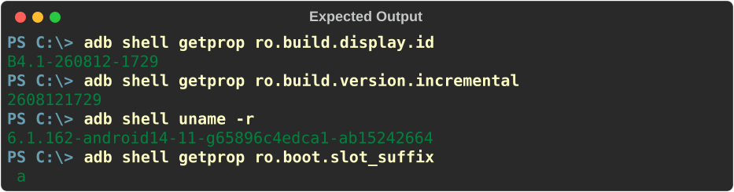

<div align="center">
  
  <h1>📱 CMF Phone 2 Pro (Galaga) — Complete Root & Bootloader Spoofing Guide</h1>
  <p>A professional A-to-Z guide for safely rooting your device and spoofing the unlocked bootloader state (using Fenrir).</p>
</div>

---

## 📱 Target Device & Firmware Details

Below is the specific firmware version this guide is built for. You **must** be on this exact build for the Fenrir bootloader spoofing to work flawlessly.

| Feature | Details |
| :--- | :--- |
| **Phone Name** | CMF Phone 2 Pro |
| **Codename** | `Galaga` |
| **Nothing OS** | 4.1 |
| **Android Version** | 16 |
| **Firmware Build** | `Galaga-B4.1-260812-1729` |
| **Kernel Version** | `6.1.162-android14-11-g65896c4edca1-ab15242664` |

---

## 🛑 Step 0: Verify Your Current Build

First, verify what version you are currently on. Connect your phone to your PC and run these commands in CMD/PowerShell:

```bash
adb shell getprop ro.build.display.id
adb shell getprop ro.build.version.incremental
adb shell uname -r
adb shell getprop ro.boot.slot_suffix
```

<details>
  <summary><b>👁️ Click Here to View Expected Output Screenshot</b></summary>
  <br>
  <div align="center">
    
  </div>
</details>
<br>

If your output does **not** match the exact versions shown in the screenshot above (meaning you are on an older version), you will need to start from **Step 1** to upgrade properly!

---

## 📥 Required Downloads (All-in-One)

To make things extremely simple, all required files are well organized below:

### 📦 1. Core Files (Firmware & Fenrir)

| File Name | Description | Download Link |
| :--- | :--- | :--- |
| **AIO Firmware (Split Zip)**<br>`Galaga_B4.1-FULL.zip`, `.z01`, `.z02` | **(Recommended)** Custom All-in-One package. Due to GitHub limits, it is split into parts. Download all 3 parts, extract the main `.zip` file, and you have everything ready to go! | [📥 Download from Releases](https://github.com/aniketlab/CMF-Phone-2-Pro-Root-Guide/releases/tag/v1.0.0-Galaga-B4.1) |
| **Standalone `init_boot.img`** | For users *already* on this firmware who only need to patch it for root (saves you downloading the huge firmware files). | [📥 Download from Releases](https://github.com/aniketlab/CMF-Phone-2-Pro-Root-Guide/releases/tag/v1.0.0-Galaga-B4.1) |
| **Fenrir Bin**<br>`galaga-fenrir.bin` | The actual file that hides the bootloader warning. | [📥 Download from Releases](https://github.com/aniketlab/CMF-Phone-2-Pro-Root-Guide/releases/tag/v1.0.0-Galaga-B4.1) |
| **Official Nothing Archive** | *(Alternative)* Official split files. You will have to extract and arrange them manually. | [Link to spike0en repo](https://github.com/spike0en/nothing_archive/releases/tag/Galaga_B4.1-260812-1729) |

### ⚙️ 2. Root Managers (Choose One)
Download **one** Manager APK of your choice. *(Note: Apatch is no longer recommended here; please use BakaSU instead)*:

| Manager Name | Official Repository Link |
| :--- | :--- |
| 🛡️ **KernelSU** | [Download KernelSU APK](https://github.com/tiann/KernelSU/releases) |
| 🚀 **KernelSU Next** | [Download KernelSU Next APK](https://github.com/KernelSU-Next/KernelSU-Next/releases) |
| 🦊 **BakaSU** *(Formerly Resuski)* | [Download BakaSU APK](https://github.com/Baka-SU/BakaSU/releases) |

---

## 🚀 Step 1: PC Setup & Bootloader Unlock

If you are new here, your bootloader is likely locked. You must unlock it to get flashing permissions. 
> [!WARNING]
> **Unlocking the bootloader will COMPLETELY WIPE / DELETE all your data.**

### 1. Download Essential Drivers
First, download and extract the official tools on your computer:
*   **Platform Tools (ADB & Fastboot):** [Official Download Link (Windows, Mac, Linux)](https://developer.android.com/tools/releases/platform-tools)
*   **Google USB Drivers:** [Official Download Link (Windows)](https://developer.android.com/studio/run/win-usb)

### 2. Manual Driver Installation (Important)
Sometimes, Windows fails to recognize the phone in Fastboot mode (you might see a yellow warning triangle in Device Manager). If that happens:
1. Open **Device Manager**.
2. Right-click the Android device with the yellow triangle and select **Update driver**.
3. Click **Browse my computer for drivers** -> **Let me pick from a list of available drivers on my computer**.
4. Select **Android Device** -> **Android Bootloader Interface**, then click Next to install.

### 3. Unlocking the Bootloader
1. On your phone, go to **Settings > About Phone** and tap **Build Number** 7 times.
2. Go back to **Developer Options** and enable both **OEM Unlocking** and **USB Debugging**.
3. Connect your phone to your PC and type:
   ```bash
   adb devices
   adb reboot bootloader
   ```
4. Once your phone is in Fastboot mode, type this command to unlock:
   ```bash
   fastboot flashing unlock
   ```

> [!CAUTION]
> **CRITICAL STEP:** The moment you hit Enter on the unlock command, your phone screen will display a bunch of code. **You only have 2 to 3 seconds to press the VOLUME UP button!** If you miss this tiny window, the command will fail, and you will have to re-enter the `fastboot flashing unlock` command and try again.

5. After pressing Volume Up, select "Unlock the bootloader" using the volume keys and confirm with the **Power button**.
6. Your phone will reset and boot up. You now have permission to flash the new firmware!

---

## ⚡ Step 2: Jump to Supported Firmware

Now that your bootloader is unlocked, let's flash the supported firmware on which Fenrir works flawlessly.

> [!TIP]
> If your device is **already** running the `Galaga-B4.1-260812-1729` build, you can skip this entire step! Just download the standalone `init_boot.img` from the Releases section and jump straight to **Step 3**.

1. Download **all 3 parts** of the AIO Firmware Zip (`.zip`, `.z01`, `.z02`) from the [Releases section](https://github.com/aniketlab/CMF-Phone-2-Pro-Root-Guide/releases/tag/v1.0.0-Galaga-B4.1) and place them in the same folder.
2. Right-click on the main file (`Galaga_B4.1-260812-1729_FULL.zip`) and select **Extract Here** using [7-Zip](https://www.7-zip.org/) or WinRAR. It will automatically combine all parts into a single ready-to-flash folder! *(This saves you the headache of manually assembling individual raw images).*
3. Ensure **USB Debugging** is enabled, then reboot back into Bootloader mode:
   ```bash
   adb reboot bootloader
   ```
3. Inside the extracted folder, double-click the **`flash_all.bat`** script.
4. The script will prompt you with a series of questions. For a successful and clean installation, answer exactly as shown below:

   | Script Prompt / Question | Your Input | Reason / Note |
   | :--- | :---: | :--- |
   | Bootloader unlocked? | **`Y`** | Required to proceed. |
   | Are you in bootloader mode? | **`Y`** | Fastboot mode is required. |
   | Fastboot drivers properly installed? | **`Y`** | Required to proceed. |
   | Begin hash verification? | **`Y`** | Good practice to verify file integrity. |
   | *Hash warning: Some files are invalid...* | **`Y`** | *(Note: The script misreads comment lines as missing files. Actual image files are 100% valid).* |
   | Wipe Data? | **`Y`** | Highly recommended for a clean installation. |
   | Flash images on both slots? | **`N`** | Flashing to the current active slot is sufficient. |
   | Disable Android Verified Boot? | **`N`** | Keep AVB enabled. |
   | Reboot to system? | **`Y`** | Reboots the phone automatically. |

> [!WARNING]
> **Do NOT press `Ctrl+C` or disconnect your phone during the flash!** 
> While flashing the `vendor_a` partition, the process may appear completely frozen for a long time (5 to 10 minutes). This is completely normal. Be patient; the script will eventually resume, complete, and display `"# DONE #"`.

5. Once flashing is finished, the flasher window will close after pressing a key, and the phone will automatically reboot into the fresh `Galaga-B4.1` version.

---

## 🛡️ Step 3: Rooting the Phone (KernelSU Next Recommended)

Now that we are on the correct firmware, we will patch the `init_boot.img` and root the phone.

### 1. Acquire the `init_boot.img`
*   **If you performed Step 2:** You already have the `init_boot.img` inside your extracted AIO Firmware folder on your PC.
*   **If you skipped Step 2:** Because you were already on the target firmware, simply download the standalone `init_boot.img` directly from the [Releases section](https://github.com/aniketlab/CMF-Phone-2-Pro-Root-Guide/releases/tag/v1.0.0-Galaga-B4.1).

Copy this `init_boot.img` and paste it into your phone's internal storage (e.g., the `Downloads` folder).

### 2. Patch the Image
1. Install your preferred Root Manager APK on your phone. **(I highly recommend using KernelSU Next for this specific setup).**
2. Open the Manager app. It will currently display **"Not Installed"** at the top.
3. Tap on **Install** ➔ choose **Select and patch a file**.
4. Browse your internal storage, select the `init_boot.img` you copied earlier, and let the patching process finish.
5. A new patched image (e.g., `kernelsu_patched_xxx.img`) will be generated in your phone's `Download` folder. Copy this patched file back to your PC and place it directly inside your `Platform Tools` folder.

### 3. Flash the Patched Image
1. Connect your phone to your PC via USB.
2. Enter Bootloader / Fastboot mode. You can do this in two ways (use whichever is easier for you):
   *   **Method A (ADB):** Ensure USB Debugging is ON and run `adb reboot bootloader` in your CMD/PowerShell.
   *   **Method B (Buttons):** Power off the phone completely, then hold **Volume Down + Power Button** until it boots into Fastboot mode.
3. *(Quick Reminder: Ensure your Fastboot drivers are working correctly, just as you did in Step 1).*
4. Flash the patched image by running the following commands (replace the filename with your actual patched file's name):
   ```bash
   fastboot flash init_boot <name_of_the_patched_file.img>
   fastboot reboot
   ```
5. Once the phone boots up, open the **KernelSU Next** app again. The status should now change to **Working**! 
   *(Alternatively, you can verify via PC using `adb shell su -c id`. If the output shows `uid=0(root)`, Boom! 💥 You are successfully rooted).*

---

## 🦊 Step 4: Flash Fenrir (Bootloader Spoofing)

### Why do we need Fenrir?
When you officially unlock a bootloader, the system's Verified Boot state changes from `green` to `orange` or `red`. This triggers the annoying "Bootloader is unlocked" warning on every boot, fails Play Integrity / SafetyNet checks, and breaks banking apps. 
**Fenrir** intercepts this boot process. By flashing it to the `lk` (Little Kernel) partition, Fenrir spoofs the bootloader state, forcing it to report a secure `green` (locked) state to the Android OS. No more warnings, and banking apps work flawlessly!

### 1. Flash the Fenrir Payload
1. Enter Bootloader mode again (via `adb reboot bootloader` or by holding the manual buttons).
2. Ensure the `galaga-fenrir.bin` file is inside your `Platform Tools` folder.
3. Run the flash command:
   ```bash
   fastboot flash lk galaga-fenrir.bin
   ```
4. You should see a success message that looks similar to this:
   ```text
   Sending 'lk' (5221 KB)                             OKAY [  0.120s]
   Writing 'lk'                                       OKAY [  0.050s]
   Finished. Total time: 0.170s
   ```

### 2. The Tricky Part: Booting to Recovery
Now you must boot into Recovery to format the data, but the standard method often fails on this device.

1. First, type the standard command:
   ```bash
   fastboot reboot recovery
   ```
2. **Did you get a Dead Android?** 
   *(Often, the phone gets stuck on a screen showing a fallen Android mascot with a red exclamation mark).* 
   If you face this issue, follow these exact steps to fix it:
   *   Press and hold **Volume Up + Power Button** simultaneously.
   *   As soon as the device turns on/restarts, **release** the buttons.
   *   The phone may restart 1 or 2 times on its own and then show a Boot Menu.
   *   In this specific menu, use the **Volume Up** button to cycle through the options until you see **Recovery Mode**.
   *   Press the **Volume Down** button to select and enter Recovery.

### 3. Format Data & Reboot
1. Once you are successfully on the Android Recovery screen, use your volume keys to select **Format Data / Factory Data Reset**.
2. Confirm the wipe. After it is complete, reboot the system.
3. Complete your normal Android initial setup (connect to Wi-Fi, add your Google account, etc.).

---

## ✅ Step 5: Final Verification & Boom! 💥

Your phone is now fully set up, but let's confirm everything is working perfectly!

1. **Restore Root Manager:** Download and install the *exact same version* of the **KernelSU Next** APK you used in Step 3. 
2. Open the app. You will see that **Root is already active**! *(The patched `init_boot` image stays intact even after the factory reset).*
3. **Verify Spoofing:** Connect your phone to your PC, ensure USB Debugging is ON, and run these final commands to check your security status:

```bash
adb shell getprop ro.boot.verifiedbootstate
# 🟢 Expected Output: green

adb shell getprop ro.boot.flash.locked
# 🟢 Expected Output: 1

adb shell getprop ro.boot.vbmeta.device_state
# 🟢 Expected Output: locked
```

**Congratulations! 🎉 Your CMF Phone 2 Pro is perfectly rooted, the bootloader warning is completely gone, and your security integrity is fully intact!**

---

## 🤝 Credits & Acknowledgements

A massive thanks to the developers and communities who made this possible:
*   **[Aniket Sharma (aniketlab)](https://github.com/aniketlab)** — Guide Author & AIO Package Creator.
*   **[The Fenrir Project](https://github.com/R0rt1z2/fenrir)** — For the amazing bootloader spoofing payload.
*   **[spike0en (Nothing Archive)](https://github.com/spike0en/nothing_archive)** — For maintaining the official firmware archives.
*   **[KernelSU Next](https://github.com/KernelSU-Next/KernelSU-Next)** & **[BakaSU](https://github.com/Baka-SU/BakaSU)** — For their incredible, undetectable root managers.
